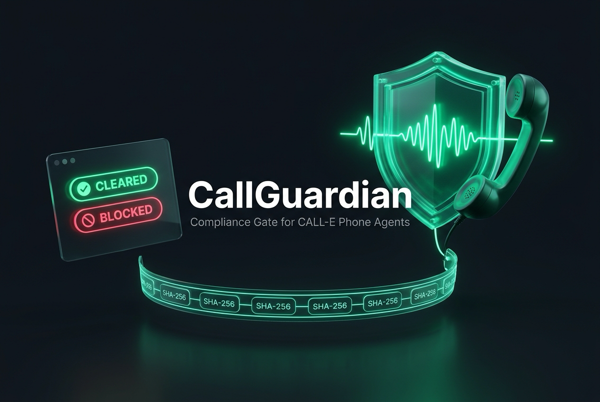
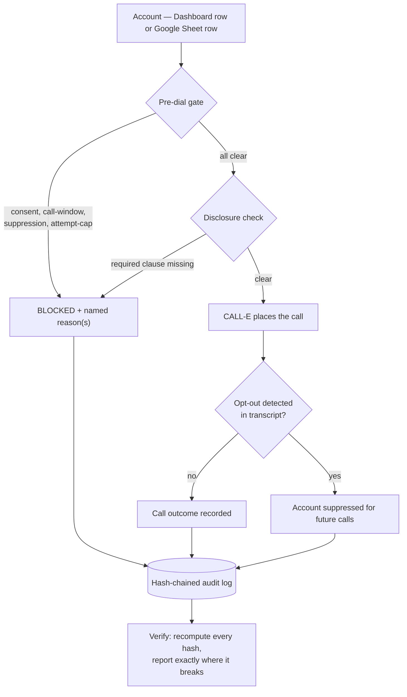

<div align="center">



# CallGuardian
### A compliance gate CALL-E calls have to pass first — pre-dial consent, call-window, and do-not-call checks, with a tamper-evident audit log, delivered from a dashboard and a Google Sheets menu.

[](#automated-test-matrix-1414-passing)
[](evals/REPORT.md)
[](https://github.com/CALLE-AI/awesome-phone-call-agents/pull/437)
[](api/rules.py)
[](pyproject.toml)
[](LICENSE)

[**Live Dashboard ↗**](https://callguardian-tkhj.onrender.com) &nbsp;&bull;&nbsp;
[**Google Sheets Plugin ↗**](plugins/google-sheets-callguardian/) &nbsp;&bull;&nbsp;
[**Demo Path ↗**](docs/DEMO_PATH.md) &nbsp;&bull;&nbsp;
[**Eval Report ↗**](evals/REPORT.md) &nbsp;&bull;&nbsp;
[**Why This Shape ↗**](docs/COMPETITIVE_NOTES.md)

</div>

---

### Why CallGuardian Exists

TCPA, FDCPA, and Reg F violations carry $500–1,500 in statutory damages **per call** in the US. A team pointing CALL-E at outbound collections, telemarketing, or healthcare outreach cannot ship on the strength of a good prompt — one uncleared call is a real liability, not a demo bug.

Every other CALL-E submission we found builds the calling agent itself. None gate it behind a real, jurisdiction-pluggable compliance engine that also ships as a spreadsheet-native community plugin — see [`docs/COMPETITIVE_NOTES.md`](docs/COMPETITIVE_NOTES.md) for the specific prior art checked before committing to this shape. CallGuardian is the layer that sits in front, so the call that gets placed is the call that was allowed to be placed.

---

## How a Call Gets Through the Gate



Source: [`api/compliance.py`](api/compliance.py), [`api/audit.py`](api/audit.py)

---

## Core Capabilities

### 1. Pre-Dial Compliance Gate
- **Four checks, always run, never short-circuited:** call-window (local to the account's own timezone), consent-on-file, do-not-call suppression, and a daily attempt cap.
- **Named reasons, never a bare pass/fail:** `OUTSIDE_CALL_WINDOW`, `NO_CONSENT`, `SUPPRESSED`, `ATTEMPT_LIMIT_EXCEEDED` — all of them, if more than one applies at once.
- **Pluggable rule packs, not a hardcoded vertical:** a fifth vertical is a new [`RulePack`](api/rules.py) dataclass instance, not new engine code.

### 2. Tamper-Evident, Hash-Chained Audit Log
- Every decision and call outcome is written to an append-only log where each entry's hash covers its own content **and** the previous entry's hash.
- Edit one line after the fact — `verify()` recomputes the whole chain and reports the exact entry where it breaks, not just "something's wrong."

### 3. Live In-Call Opt-Out Detection
- The call transcript is checked for revocation language (`"stop calling me"`, `"take me off your list"`, and variants) the moment the call completes.
- A detected opt-out suppresses the account automatically — no human has to remember to update a suppression list.

### 4. Two Surfaces, One Engine
- **Dashboard:** sign up, see seeded accounts, check/call/verify, watch the audit chain break under a deliberate tamper.
- **Google Sheets plugin:** a `CallGuardian` menu in any spreadsheet — outreach teams keep lists there already, so the gate meets them where they work instead of asking them to adopt a new tool.
- Both write to the **same** audit ledger.

### 5. A Real CALL-E Integration, Live-Verified
- [`api/calle_client.py`](api/calle_client.py) calls CALL-E's actual `/v1/calls` endpoint — confirmed against two real calls to a reserved fictional number, not assumed from documentation. See its docstring and [`docs/FAILURE_CASE.md`](docs/FAILURE_CASE.md) for exactly what was verified and what remains an honest, named gap.

---

## What the Gate Actually Enforces

| Rule pack | Statute basis | Call window | Consent required | Disclosure required |
|---|---|---|---|---|
| `us-tcpa-collections` | 47 U.S.C. §227 (TCPA) · 15 U.S.C. §1692c (FDCPA) · 12 CFR Part 1006 (Reg F) | 08:00–21:00 local | yes | yes |
| `us-telemarketing-dnc` | 47 U.S.C. §227 (TCPA) · 16 CFR Part 310 (TSR / National DNC) | 08:00–21:00 local | yes | yes |
| `appointment-reminder` | TCPA established-business-relationship exemption | 08:00–20:00 local | no | no |
| `healthcare-outreach` | 47 CFR §64.1200(a)(3)(v) · 45 CFR §164.502(b) (HIPAA minimum-necessary) | 08:00–20:00 local | no | yes |

Source: [`api/rules.py`](api/rules.py) — the full, inspectable definition for each pack, including opt-out phrase lists and re-consent cooldowns.

---

## 8 Seeded Evaluator Scenarios (Dashboard & Sheets)

No empty-form first screen: the dashboard and the sample Google Sheet both open on eight accounts chosen to exercise every reason code without any setup.

| Account | Rule pack | Scenario | Expected gate result |
|---|---|---|---|
| Jordan Blake | US collections | Consented, in-window, clean | `CLEARED` |
| Priya Nair | US collections | No consent on file | `BLOCKED: NO_CONSENT` |
| Marcus Webb | US collections | Said "stop calling me" last call | `BLOCKED: SUPPRESSED` |
| Elena Torres | US collections | Opted out, then re-consented on a recorded line | `CLEARED` (re-consent postdates suppression) |
| Sam O'Reilly | US telemarketing | Already dialed today's cap | `BLOCKED: ATTEMPT_LIMIT_EXCEEDED` |
| Dana Ferreira | Appointment reminder | No consent on file | `CLEARED` (pack doesn't require it) |
| Grace Kim | Healthcare outreach | Lab-results follow-up | `CLEARED` |
| Tobias Reid | US collections | Relocated; local hours fall at 2–6am | `BLOCKED: OUTSIDE_CALL_WINDOW` most of the day |

Source: [`fixtures/accounts.seed.json`](fixtures/accounts.seed.json)

---

## Project Structure

```
├── AGENTS.md                          # Agent handoff — state, open items, hard rules
├── README.md                          # This file
├── render.yaml                        # Public deploy config (DEMO_MODE=1, safe by default)
├── Dockerfile
├── api/
│   ├── rules.py                       # Rule packs — the only file a new vertical touches
│   ├── compliance.py                  # The gate: evaluate_predial / _script / _transcript
│   ├── audit.py                       # Hash-chained append-only log + verify()
│   ├── accounts.py                    # Seeded account store (mutable, reseed-able)
│   ├── auth.py                        # Hashed-password signup/signin, signed session cookie
│   ├── calle_client.py                # The one module that calls CALL-E at runtime
│   └── main.py                        # FastAPI routes — dashboard pages + the gate API
├── templates/                         # Landing, signin/signup, dashboard (server-rendered)
├── plugins/
│   └── google-sheets-callguardian/    # The Apps Script plugin — the actual PR contribution
├── evals/
│   ├── cases.jsonl                    # 27 compliance scenarios (predial/script/transcript)
│   └── run_evals.py
├── tests/
│   └── test_api.py                    # 14 tests, DEMO_MODE, no network required
├── fixtures/
│   ├── accounts.seed.json             # The 8 evaluator scenarios above
│   └── calle/                         # DEMO_MODE call outcome fixtures
└── docs/
    ├── BOUNTIES.md                    # Prize-criteria mapping
    ├── COMPETITIVE_NOTES.md           # What was checked before choosing this shape
    ├── FAILURE_CASE.md                # What's verified live vs. still an honest gap
    └── DEMO_PATH.md                   # The exact click-path the demo video follows
```

---

## Quickstart & Verification

```bash
# 1. Clone and enter the repo
git clone https://github.com/ayodejiades/callguardian.git
cd callguardian

# 2. Install dependencies (uv-managed)
uv sync --all-groups

# 3. Copy the env template — DEMO_MODE=1 needs no CALL-E account at all
cp .env.example .env

# 4. Run it locally
make dev

# 5. Run the test suite (14/14, offline)
make test

# 6. Run the compliance eval harness (27/27, writes evals/REPORT.md)
make prewarm

# 7. Reset the seeded accounts to their pristine state after poking at them
make reseed
```

---

## Automated Test Matrix (14/14 Passing)

```bash
$ DEMO_MODE=1 uv run pytest -q
```

| Test | Verifies | Status |
|---|---|---|
| `test_health_reports_demo_mode` | Health endpoint reports `DEMO_MODE` accurately | **PASS** |
| `test_landing_page_loads` | Landing page renders | **PASS** |
| `test_signup_then_signin_then_dashboard` | Full auth flow, session cookie, dashboard access | **PASS** |
| `test_dashboard_redirects_when_signed_out` | No session → redirected, not shown the dashboard | **PASS** |
| `test_gate_check_clears_a_consented_in_window_account` | A clean account clears with no reasons | **PASS** |
| `test_gate_check_blocks_no_consent` | Missing consent blocks with `NO_CONSENT` | **PASS** |
| `test_gate_check_blocks_suppressed_account` | A suppressed account blocks with `SUPPRESSED` | **PASS** |
| `test_gate_check_allows_reconsented_account` | Re-consent postdating suppression clears the account | **PASS** |
| `test_gate_check_blocks_over_attempt_limit` | Daily attempt cap enforced | **PASS** |
| `test_place_call_is_refused_for_a_blocked_account` | The gate is re-checked at call time, not trusted from an earlier check | **PASS** |
| `test_place_call_succeeds_and_writes_audit_entries` | A cleared call writes a real, verifiable audit hash | **PASS** |
| `test_gate_check_external_for_a_sheet_row` | The Google Sheets plugin's inline-account path works standalone | **PASS** |
| `test_place_call_external_is_refused_outside_the_call_window` | Sheet-sourced accounts get the same gate as dashboard accounts | **PASS** |
| `test_audit_chain_verifies_and_tamper_breaks_it` | Tampering one entry is caught, and only that entry | **PASS** |

The eval harness ([`evals/REPORT.md`](evals/REPORT.md)) runs a further 27 scenarios directly against the compliance engine — including two cases pinned to the opt-out matcher's known, honestly-documented limits rather than hiding them.

---

<div align="center">
  <sub>CallGuardian · Built independently for <a href="https://github.com/CALLE-AI/awesome-phone-call-agents">CALL-E: Your Code Is Calling</a>. Not affiliated with CALL-E. Illustrations by <a href="https://undraw.co/illustrations">unDraw</a> (MIT). Licensed MIT.</sub>
</div>
